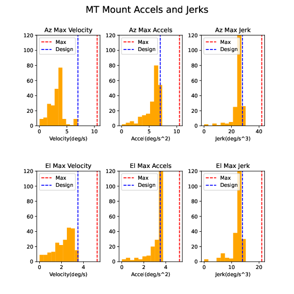

:tocdepth: 1

.. sectnum::

.. Metadata such as the title, authors, and description are set in metadata.yaml

Abstract
========

This technote shows analysis of velocity, acceleration, and jerk of the TMA during random walk slews of 3.5 degrees on multiple nights.  Most slews are within the specifications, but some fail, probably because of noisy values in the encoders.

Methodology
================

The goal of this study was to analyze the velocities, accelerations, and jerks of the TMA mount during a series of random slews.  This was done using the azimuth and elevation velocity data stored in the EFD.  The velocity data during a slew was fit with an order 3 spline, which was then differentiated to obtain the acceleration and jerk values.  Smoothing was applied to the generated spline, and it is important to note that the results are heavily dependent on that smoothing.  Not enough smoothing, and the results are impacted by random noise in the velocity values, and too much smoothing and the spline does not fit the velocity data well.  I believe the choices made here are a good compromise, but these can always be changed.

The notebook that did this analysis and made the plots in this technote is available at:
https://github.com/craiglagegit/Notebook_Keeper/blob/main/summit_notebooks/MTMount_Vel_Accel_Jerk_23Mar23.ipynb

Results
====================

A typical slew is shown in Figure 1.  The position values are directly from the EFD with no smoothing.  The velocity values in the EFD are shown as crosses in the second plot down, with the spline fit shown as a solid line. The acceleration and jerk plots are obtained by differentiating the velocity spline using the scipy.interpolate.UnivariateSpline.derivative function. A total of 380 slews from 2 nights were analyzed in this way.

.. image:: ./_static/MT_Mount_Accel_Jerk_Typ_20230323T081402.png

Figure 1.  Typical position/velocity/acceleration/jerk plot.

Figures 2 and 3 show summary histograms from these two nights, with the design values as blue dotted vertical lines and the max values as red dotted vertical lines.  It can be seen that most slews meet the specifications, but there are a few failures, which are discussed in the next section.

Figure 2.  Summary histograms from 26Jan23.  This contains 262 slews.

.. image:: ./_static/Max_Accel_Jerks_22Mar23.png

Figure 3.  Summary histograms from 22Mar23.  This contains 118 slews.

Failures
==========================

Most of the failures are due to noise in the actualVelocity values in the EFD.  Differentiating this noise results in large variations in acceleration and jerk.  A typical plot that failed the jerk specification is shown in Figure 4.  All of the plots that failed any specification are available at the summit in /scratch/cslage/tma/MTMount_accel_jerk_fails.

Figure 4.  A typical failing plot.  This failed both the azimuth acceleration and azimuth jerk specification.

Summary
==========================

This technote shows a summary of the TMA performance for velocity, acceleration, and jerk durin soak test on on two nights.  Most slews meet the specifications, but there are a few failures, mostly caused by noise in the EFD velocity values.

