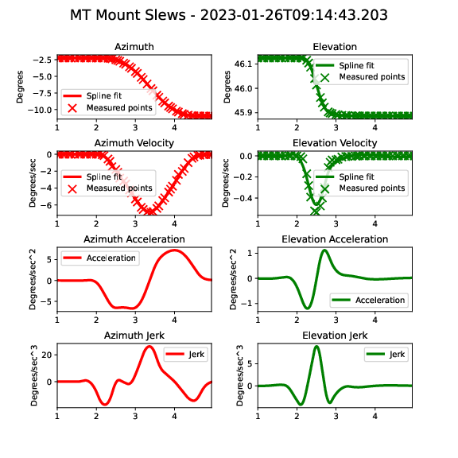

:tocdepth: 1

.. sectnum::

.. Metadata such as the title, authors, and description are set in metadata.yaml

Abstract
========

This technote shows analysis of velocity, acceleration, and jerk of the TMA during random walk slews of 3.5 degrees on multiple nights.  All slews are within the specifications.

Methodology
================

The goal of this study was to analyze the velocities, accelerations, and jerks of the TMA mount during a series of random slews.  This was done using the azimuth and elevation velocity data stored in the EFD.  The position data was fit with a spline and compared to the measured data. The velocity data during a slew was also fit with a spline, which was then differentiated to obtain the acceleration data.  The acceleration spline was then smoothed before being differentitaed again to generate the jerk data. An earlier version of this technote had many slews which were failing for high jerk values.  It is believed that the improved smoothing algorithm shown here generates acceleration and jerk profiles which are more "real" and not as dependent on noise in the encoder data stream.

The notebook that did this analysis and made the plots in this technote is available at:
https://github.com/craiglagegit/Notebook_Keeper/blob/main/summit_notebooks/MTMount_Vel_Accel_Jerk_24Mar23.ipynb

Results
====================

Typical slews are shown in Figures 1 and 2.  In the top plots, the position values from the EFD are shown with a fitted spline, but this spline is not used in subsequent analysis.  The velocity values in the EFD are shown as crosses in the second plot down, with the spline fit shown as a solid line. The acceleration plots are obtained by differentiating the velocity spline using the scipy.interpolate.UnivariateSpline.derivative function, and the jerk values are obtained by similarly differentiating the acceleration values. Each spline is smoothed before being differentiated.  A total of 380 slews from 2 nights were analyzed in this way.

Figure 1.  Typical position/velocity/acceleration/jerk plot from the night of January 26, 2023..

Figure 2.  Typical position/velocity/acceleration/jerk plot from the night of March 22, 2023.

Figures 3 and 4 show summary histograms from these two nights, with the design values as blue dotted vertical lines and the max values as red dotted vertical lines.  It can be seen that all values are within the specifications.  It should be noted that an earlier version of this technote showed failures due to noise in the encoder streams, but these have been eliminated with an improved smoothing algorithm, as discussed in the next section.

.. image:: ./_static/Max_Accel_Jerks_26Jan23.png

Figure 3.  Summary histograms from 26Jan23.  This contains 223 slews.

Figure 4.  Summary histograms from 22Mar23.  This contains 119 slews.

Failures
==========================

As discussed above, an earlier version of this technote showed failures due to noise in the encoder streams, but these have been eliminated with an improved smoothing algorithm.  A typical plot that failed the jerk specification with the earlier algorithm is shown in Figure 5.  Figure 6 shows the same slew with the improved algorithm, where the noise from the velocity values in the encoder stream have been smoothed out.

.. image:: ./_static/MT_Mount_Accel_Jerk_Fail_20230126T091443.png

Figure 5.  A typical failing plot with the older algorithm.  This failed both the azimuth acceleration and azimuth jerk specification.

Figure 6.  The same slew plotted with the improved algorithm.  The noise in the encoder stream has been smoothed out.

Summary
==========================

This technote shows a summary of the TMA performance for velocity, acceleration, and jerk durin soak test on on two nights.  All slews meet the specifications for velocity, acceleration, and jerk.

